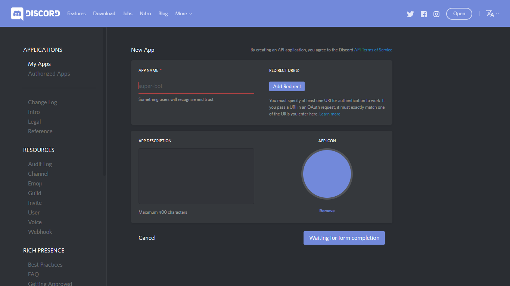
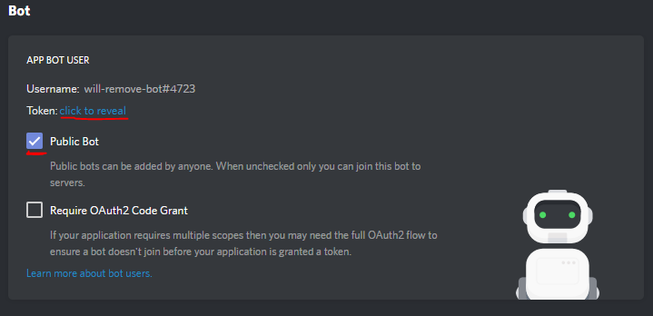

# ShowBot and ShowTimes API

This quickstart consists of two frameworks:
1. **ShowBot**: This is a Discord python bot that fetches you the theatres and showtimes for a movie of your choice, in your city, for a given date, interactively. Integrate it with your Discord server in under five minutes.

2. **ShowTimes API**: This is a RESTful API written by Hyper to fetch the showtimes and return it as a json. This is what the bot uses for its functioning. This one is written in Python Flask and hosted over an Nginx server through Gunicorn.


## Requirements

1. [hasura CLI tool](https://docs.hasura.io/0.15/manual/install-hasura-cli.html)
2. A Discord server
3. Python 3.6 (For testing and upgrading)


## Setup Guide

### Get the project

```sh
$ hasura quickstart hyper/showbot
```

### Create a bot on discord

1. [Create an application](https://discordapp.com/developers/applications/me/create).



2. Now, in your application home page, scroll down to `Bots` and create a bot.


3. Make the bot public.

4. Make sure that the `Require OAuth2 Code Grant` checkbox is not checked.

5. Add the bot to your server by clicking on `Generate OAuth URL`. While generating it, make sure to choose appropriate permissions for the bot, which should include:
 * Send Messages
 * Manage Messages
 * Add Reactions
 Navigate to the generated URL from the browser.

5. Copy the bot token and add it to the project secrets.



```
$ hasura secret update discord.bot_token.key <bot_token>
```

### Push the project to the cluster

```
$ git add .
$ git commit -m "First commit"
$ git push hasura master
```

## Usage

Type `$showtimes` in the server chat and see the magic :)

## Modification

This project can also be used as a starter for building more complex Discord bots. The source code for the bot lies in the `microservices/discordbot/src/` directory. And if you want to improve the showtimes API, the source code is available at `microservices/discordbot/src/`.

You might also want to look at the `Dockerfile` and the `k8s.yaml` at `microservices/discordbot/` and `microservices/spider/` if you are to add some extra packages or environment variables.

## Possible Improvements

You can improve both the bot and the API. 
Try to implement `threading` to generate the json faster in the API. 
Add more commands and features to the bot. 
Play around with the Reaction emojis. 
Replace `requests` with `aiohttp` to make the http calls asynchronous. 
Use Hasura's filestore API to cache data for commonly searched movies.

## Acknowledgements

1. Special thanks to "Rapptz" for the [discord bindings for python](https://github.com/Rapptz/discord.py/tree/rewrite).
2. Built on top of Hasura boilerplate [hello-golang-raw](https://hasura.io/hub/project/hasura/hello-python-flask).
